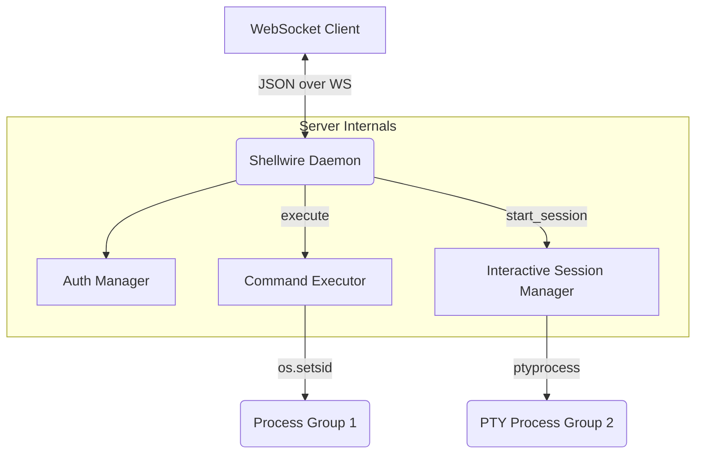

# Shellwire Documentation

**WebSocket daemon for remote shell access. Built to empower Android apps and agents with a full desktop-like shell via Termux.**

Shellwire runs as a robust WebSocket server that acts as a bridge, allowing remote clients to execute shell commands with full system access. While fully compatible with Linux and macOS, it is uniquely engineered for Android devices. Android applications typically lack proper terminal access, making it difficult to run local AI agents or advanced tools on-device. Shellwire solves this by running inside Termux and exposing a WebSocket server, acting as a bridge to give Android apps a complete, desktop-grade shell environment.

## Core Capabilities

*   **Stable Token Authentication**: Tokens are generated once on the first start and persist across daemon restarts.
*   **Concurrent Execution**: Process up to 4 simultaneous commands with automatic background queuing.
*   **Interactive PTY Sessions**: Full POSIX pseudo-terminal support, including dynamic terminal resizing and interactive I/O.
*   **Robust Process Isolation**: Commands run in isolated process groups, enabling SIGTERM → SIGKILL escalation to prevent zombie processes.
*   **Mobile / Termux Optimized**: Engineered with resilience against Android phantom process killers, terminal DOZE states, and intermittent network handoffs.
*   **Environment Tracking**: Persists working directory (CWD) and environment variables.

## Architecture Overview

Shellwire connects remote clients to the host system shell via a structured JSON-over-WebSocket protocol.

## Documentation Structure

The enterprise documentation is split into specialized guides:

1.  **[Daemon Guide](daemon_guide.md)**: Server administration, configuration, authentication management, and deployment strategies.
2.  **[Protocol Specification](protocol_spec.md)**: Strict JSON schemas and lifecycle state machines for communicating with the WebSocket server.
3.  **[Client Integration](client_integration.md)**: Developer guide for building custom WebSocket clients (featuring Kotlin examples) and implementing network resilience.
